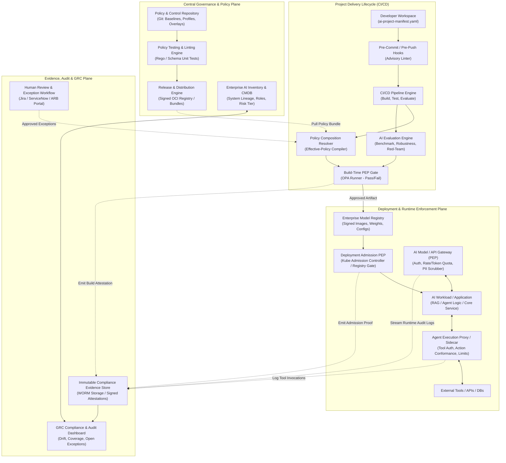

# AI Governance-as-a-Service Framework: Stage 1 Architecture & Design

**Document ID:** `ARCH-STAGE1-2026-001`  
**Version:** `1.0.0-PROPOSED`  
**Status:** `DRAFT / PROPOSED AWAITING REVIEW`  
**Date:** October 2026  
**Audience:** Enterprise Architects, AI Engineers, Governance, Risk & Compliance (GRC) Leads, Security & Privacy Officers  

---

## Executive Summary & Initial Response

### 1. Concise Feasibility Verdict
Delivering AI governance as a reusable, versioned enterprise capability ("Governance-as-a-Service") is **feasible and highly advantageous**, provided it is built as a **hybrid socio-technical system** rather than an assumed 100% automated software drop-in. 
- **What is feasible:** Centralizing policy definitions, deterministic build-time and deployment-time gates, runtime policy enforcement points (API gateways, tool authorization filters, rate/token quotas), automated compliance evidence harvesting, and composable baseline/overlay engines.
- **What is NOT feasible:** Treating governance as an autonomous "plug-and-play" black box that relieves delivery teams of accountability, eliminates human risk assessment, or provides automatic legal compliance guarantees across varied regulatory jurisdictions.

### 2. Recommended Architectural Approach
We recommend a **Decoupled Composable Layered Architecture** with distinct Policy Decision Points (PDP) and Policy Enforcement Points (PEP):
1. **Four-Layer Composition Model:** Enterprise Baseline $\rightarrow$ Context Profiles & Overlays $\rightarrow$ Project Configuration $\rightarrow$ Authorized Exceptions.
2. **Policy-as-Code & Declarative Manifests:** Projects declare characteristics via a version-controlled manifest (`ai-project-manifest.yaml`). A deterministic resolver combines the manifest with versioned policy bundles to generate an immutable, signed *Effective-Policy Snapshot*.
3. **Decoupled Enforcement:** Lightweight, localized PEPs (Git hooks, CI/CD linters, container admission controllers, API/agent proxy sidecars) query PDPs evaluating Open Policy Agent (OPA) / Rego or CEL bundles locally or via a low-latency shared gateway.
4. **Unified Evidence & Audit Store:** Structured, cryptographically hashed evidence records are continuously streamed into an immutable compliance store, mapping pipeline artifacts and runtime telemetry directly to governance obligations.

### 3. Run Scope and Assumptions
- **Run Scope:** Full Framework — Stage 1 of 5.
- **Deliverables Included:** 
  - Deliverable 1: Feasibility and boundaries
  - Deliverable 2: Principles and baseline structure
  - Deliverable 3: Reference architecture
  - Deliverable 5: Profiles, overlays, and policy composition
- **Operating Assumptions:**
  - **Organization Context:** UNKNOWN (generic enterprise baseline assumed).
  - **Delivery Model:** Internal shared service serving diverse project teams.
  - **Tech Stack:** Heterogeneous (cloud/hybrid, containerized, polyglot programming models, mixed LLM/predictive ML engines).
  - **AI Scope:** Multi-modal (predictive ML, Generative AI / RAG, autonomous agents with tool-calling capabilities).
  - **Baseline Status:** First run (`APPROVED BASELINE: NONE`). All proposed structures, controls, and schemas are marked `PROPOSED` awaiting Review Board approval.

### 4. High-Value Clarification Questions
To tailor subsequent stages (Stages 2–5) to your organization's exact environment, please answer as many of the following as possible:
1. **Regulatory & Statutory Scope:** What primary jurisdictions and sector regulations apply (e.g., EU AI Act, US Executive Orders / State laws, NIST AI RMF, HIPAA, PCI-DSS, FINRA / NYDFS)?
2. **Target Infrastructure & Toolchain:** What Git/CI/CD platform (GitHub, GitLab, Azure DevOps) and runtime environment (Kubernetes, AWS SageMaker, Azure AI, GCP Vertex, on-premises) form the core delivery stack?
3. **Model & Agent Platforms:** What model access layers and agent frameworks are being standardized or observed in shadow use (e.g., LiteLLM, vLLM, Azure OpenAI, LangChain, LlamaIndex, AutoGen, CrewAI, MCP servers)?
4. **Enterprise GRC & IAM Systems:** What existing platforms must this integrate with for ticketing, risk registration, identity, and CMDB (e.g., ServiceNow, Jira, RSA Archer, OpenPages, Okta, Microsoft Entra ID)?
5. **Operating Model Governance Structure:** Does the organization favor a centralized AI Review Board (ARB) approving all projects, or a federated risk model with embedded domain compliance champions?

---

## Deliverable 1: Feasibility and Boundaries

### 1.1 What "Plug-and-Play" Realistically Means
In enterprise software delivery, "plug-and-play" is frequently misconstrued as zero-effort, turn-key automation. For AI governance, **plug-and-play realistically means**:
- **Standardized Declarative Contracts:** Developers add a machine-readable manifest (`ai-project-manifest.yaml`) to their repository, declaring their AI system's archetype, intended use, data classifications, and components.
- **Drop-in Enforcement Kits:** Shared CI/CD pipeline templates, container admission policies, and gateway configurations can be included with 1–2 lines of configuration without teams writing bespoke compliance scripts.
- **Automated Evidence Harvesting:** Standardized test runners and runtime gateways automatically emit cryptographically verifiable compliance attestations (e.g., test results, SBOMs, prompt injection evaluations) into a central store.

**What remains strictly project-specific:**
1. **Intended Purpose and Context Formulation:** Defining precisely what business problem the model solves and where it is deployed.
2. **Domain-Specific Risk & Bias Validation:** Establishing fairness metrics, representative evaluation datasets, and acceptable error tolerance thresholds based on clinical, financial, or operational impact.
3. **Accountability Sign-Off:** Senior stakeholder acceptance of residual risk and operational ownership.
4. **Edge-Case Human Oversight:** Designing the specific business procedures for human intervention when model confidence is low or when an anomalous output occurs.

### 1.2 Activity Classification: Automation, Supported Workflow, and Human Judgment
To establish operational boundaries, all governance activities are classified into three distinct operating tiers:

| Tier | Activity Classification | Description | Representative Examples |
|---|---|---|---|
| **Tier A** | **Fully Automatable** | Deterministic technical checks with zero human subjectivity; binary pass/fail outcomes. | - Software Bill of Materials (SBOM) generation & CVE scanning<br>- Static analysis of model manifests and configuration schemas<br>- Dataset and model file cryptographic hash verification<br>- Hardcoded secret, PII, and API token detection in prompts/code<br>- Runtime rate limiting, token throttling, and egress domain whitelisting<br>- Deterministic policy-as-code admission gates (e.g., OPA Rego rules) |
| **Tier B** | **Supported by Workflow & Evidence Collection** | Automated execution of tests, metric aggregations, and routing, where results require human review or contextual validation. | - Synthetic red-teaming and benchmark evaluation test runs<br>- Statistical data drift and model performance drift alerting<br>- Disparate impact and fairness metric calculations<br>- Automated routing of exception requests and re-certification reminders<br>- Aggregation of lineage artifacts across data, code, and model registries |
| **Tier C** | **Dependent on Human Judgment** | Qualitative, legal, ethical, and organizational decisions that cannot be delegated to an algorithm. | - Determination of legal classification (e.g., EU AI Act Prohibited vs. High-Risk)<br>- Trade-off decisions between model accuracy and disparate impact<br>- Acceptance of business and residual operational risk<br>- Approval of time-limited policy exceptions with compensating controls<br>- Root-cause adjudication of safety or ethical incidents and contestability disputes |

### 1.3 Reusable Control Intent vs. Reusable Implementation
A fundamental architectural flaw in many governance initiatives is conflating *control intent* with *control implementation*. 

```
+--------------------------------------------------------------------------+
| Control Intent (Abstract, Stable across Enterprise)                      |
| "All agent tool executions must be authenticated and authorized against |
| least-privilege resource policies prior to execution."                   |
+--------------------------------------------------------------------------+
                                    |
                    Implemented via specialized adapters
                                    |
        +---------------------------+---------------------------+
        |                                                       |
        v                                                       v
+-------------------------------+       +-------------------------------+
| Implementation A (HTTP/REST)  |       | Implementation B (MCP / RPC)  |
| Reverse-proxy API Gateway     |       | Model Context Protocol (MCP)  |
| inspecting OAuth2 bearer      |       | proxy validating client certs |
| tokens and JWT scope claims.  |       | and method-level capabilities.|
+-------------------------------+       +-------------------------------+
```

- **Reusable Control Intent (Universal):** The governance policy definition that specifies *what* risk is mitigated, the target standard, the accountable owner, and the evidence required. This remains consistent across all technologies.
- **Reusable Implementation (Context-Dependent):** The software mechanism, policy-as-code snippet, or infrastructure plugin that enforces the intent. Implementation libraries are maintained as modular adapters (e.g., an Envoy sidecar filter, an OPA Rego snippet for CI/CD, or a Python middleware wrapper).
- *Feasibility Boundary:* An organization cannot achieve 100% implementation reuse across heterogeneous stacks, but can achieve near-universal intent reuse and high implementation reuse within standardized runtime archetypes.

---

## Deliverable 2: Principles and Baseline Structure

### 2.1 Enterprise AI Principles Charter
The governance framework is anchored on six core principles. Each principle maps directly to enterprise governance domains to ensure institutional alignment.

```
                         Enterprise AI Principles
                                     |
       +-----------------------------+-----------------------------+
       |                             |                             |
[ Accountability ]           [ Safety & Robustness ]     [ Transparency & Fairness ]
  - Model Risk Management       - Cybersecurity             - Legal & Compliance
  - Internal Audit              - SRE / Platform Ops        - DEI & Ethics Board
       |                             |                             |
[ Privacy & Stewardship ]    [ Human Agency & Oversight ]  [ Value Alignment & Cost ]
  - Data Governance Office      - Business Operations       - FinOps & Procurement
  - Privacy / Legal             - Customer Experience       - Enterprise Architecture
```

1. **Principle 1: Accountability & Governance Integrity (`PRIN-GOV`)**
   - *Statement:* Every AI system must have an identified business owner, a designated technical owner, registered lineage, and documented lifecycle accountability.
   - *Domain Tracing:* Model Risk Management (MRM), Internal Audit, Enterprise Architecture.
2. **Principle 2: Safety, Security & Technical Robustness (`PRIN-SEC`)**
   - *Statement:* AI systems must be resilient against adversarial exploitation, maintain operational stability under stress, and enforce strict boundaries on autonomous execution.
   - *Domain Tracing:* Information Security (CISO), Platform Engineering, Site Reliability Engineering (SRE).
3. **Principle 3: Transparency, Explainability & Provenance (`PRIN-TRN`)**
   - *Statement:* AI capabilities, limitations, data origins, and automated decision rationales must be discoverable, traceable, and appropriately disclosed to affected stakeholders.
   - *Domain Tracing:* Legal & Regulatory Affairs, Customer Trust, Ethics Committee.
4. **Principle 4: Fairness, Non-Discrimination & Societal Impact (`PRIN-FAI`)**
   - *Statement:* AI systems must be evaluated for disparate impact, bias, and unfair discrimination, actively safeguarding fundamental rights and protected classes.
   - *Domain Tracing:* Compliance, Human Resources, Diversity & Ethics Boards.
5. **Principle 5: Privacy, Data Stewardship & Intellectual Property (`PRIN-DAT`)**
   - *Statement:* Data utilized across training, fine-tuning, RAG retrieval, and inference must adhere to data minimization, lawful processing grounds, residency mandates, and IP licensing terms.
   - *Domain Tracing:* Data Governance Office (CDO), Chief Privacy Officer (CPO), Corporate Legal.
6. **Principle 6: Human Agency, Contestability & Redress (`PRIN-HUM`)**
   - *Statement:* AI systems must empower human decision-making, maintain meaningful human oversight mechanisms proportional to risk, and support dispute contestability.
   - *Domain Tracing:* Business Operations, Product Management, Customer Relations.

---

### 2.2 Composable Baseline & Extension Hierarchy

The framework enforces governance through four composable layers. Higher layers can tighten or specialize lower layers, but can never weaken or override mandatory baseline requirements without an explicit, time-limited, approved exception.

```
=============================================================================
LAYER 4: AUTHORIZED EXCEPTIONS (Time-limited, Compensating Controls, ARB Approved)
=============================================================================
   ^
   | Constrains / Overrides with justification
=============================================================================
LAYER 3: PROJECT CONFIGURATION & EXTENSIONS (Project-specific thresholds & tools)
=============================================================================
   ^
   | Selects & Configures
=============================================================================
LAYER 2: CONTEXT PROFILES & OVERLAYS (Sector, Jurisdictional, Modality rules)
   * Profiles: Archetype-based (e.g., GenAI RAG, Agentic, Predictive ML)
   * Overlays: Statutory/Contractual (e.g., EU AI Act High-Risk, HIPAA, PCI)
=============================================================================
   ^
   | Extends & Specializes
=============================================================================
LAYER 1: ENTERPRISE BASELINE (Universal obligations applicable to ALL AI systems)
=============================================================================
```

#### Placement Rules and Borderline Criteria
- **Enterprise Baseline (Layer 1):** Contains universal process requirements (e.g., mandatory inventory registration, basic vulnerability scanning, ownership assignment) and universal conditional controls (e.g., "IF personal data is processed, THEN apply privacy masking").
- **Context Profiles & Overlays (Layer 2):** 
  - *Profiles:* Group controls by technical archetype (e.g., `PRF-GENAI-RAG`, `PRF-AGENTIC`).
  - *Overlays:* Group obligations by external environment (e.g., `OVL-JUR-EU-AIACT`, `OVL-SEC-FINANCE`).
- **Project Configuration (Layer 3):** Allows projects to supply specific parameter values (e.g., defining `target_latency_ms: 250` or `f1_score_threshold: 0.88`) or activate additional internal project checks.
- **Authorized Exceptions (Layer 4):** Formal deviations granted for a maximum duration (e.g., 90 days) requiring compensating controls, risk acceptance sign-off, and automated expiration tracking.

#### Borderline Case Placements:
1. **Agent Tool Authorization:** Is it Baseline or Profile?  
   *Decision:* Placed in the **Enterprise Baseline as a Reusable Conditional Control**. The intent (`CTL-SEC-002`) resides in the baseline library with the condition: `when: "system.capabilities.agent_tool_execution == true"`. It is NOT duplicated in individual overlays.
2. **Data Residency Restrictions:** Is it Baseline or Overlay?  
   *Decision:* The parameterized control mechanism (`CTL-DAT-003`) resides in the Baseline; specific geographical constraints (e.g., `allowed_regions: ["eu-central-1", "eu-west-1"]`) are injected via **Jurisdictional Overlays**.
3. **Model Accuracy & Hallucination Thresholds:** Baseline or Project?  
   *Decision:* The evaluation obligation (`CTL-EVAL-001`) resides in the Baseline/Profile; exact numerical thresholds reside in **Project Configuration**, bounded by minimum overlay floors.

#### Handling "Not Applicable" and "Unknown"
- **Unknown Applicability:** If a manifest field is omitted or marked `UNKNOWN`, the Policy Composition Resolver flags the state as `UNRESOLVED_APPLICABILITY`. It is **never** silently excluded. Deployment gates block promotion until clarified.
- **Not Applicable (N/A) Determinations:** Must be explicitly recorded in the Project Manifest with a documented justification, referencing the specific control ID, and signed off by an authorized role.

---

### 2.3 Identifier Scheme
To prevent collisions, support policy-as-code automation, and maintain immutable audit trails, the following hierarchical identifier scheme is established:

```
[CATEGORY]-[DOMAIN]-[NUMBER]

Examples:
- PRIN-GOV-001  : Principle - Governance - 001
- POL-SEC-002   : Policy - Security - 002
- STD-DAT-003   : Standard - Data Stewardship - 003
- CTL-EVAL-004  : Control - Evaluation & Testing - 004
- PRF-ARCH-RAG  : Profile - Architecture - RAG Archetype
- OVL-REG-EU-01 : Overlay - Regulatory - EU AI Act
- EXC-2026-0012 : Exception - Year 2026 - Sequence 0012
```

- **Domain Codes:** `GOV` (Governance/Inventory), `SEC` (Security/Cyber), `DAT` (Data/Privacy), `EVAL` (Evaluation/Robustness), `OPS` (Operations/MLOps), `HUM` (Human Oversight/Ethics).
- **Rule:** Identifiers are permanent and immutable. If a control is deprecated, its identifier is retired, never reassigned.

---

### 2.4 Provisional Control Examples
The following four representative controls establish the concrete patterns used throughout the framework.

#### 1. Universal Process Obligation: `CTL-GOV-001`
- **Identifier:** `CTL-GOV-001`
- **Objective:** Ensure every AI system is formally registered in the enterprise CMDB/inventory with assigned human ownership prior to deployment.
- **Layer:** Layer 1 (Enterprise Baseline)
- **Applicability:** **Universal** (Applies to all AI systems, prototypes, and deployments without exception).
- **Parameters:**
  - `registration_portal_url`: string (default: `"https://grc.internal.net/ai-inventory"`)
  - `required_roles`: `["business_owner", "technical_owner", "risk_assessor"]`
- **Enforcement Point:** CI/CD deployment gate (blocking).
- **Automated Verification:** Pipeline linter checks for valid `ai-project-manifest.yaml` and queries inventory API to verify registration status and active owner credentials.

#### 2. Conditional Technical Control: `CTL-SEC-002`
- **Identifier:** `CTL-SEC-002`
- **Objective:** Restrict agent tool/action execution to pre-approved schemas, validating runtime arguments and enforcing least-privilege identity delegation.
- **Layer:** Layer 1 (Enterprise Baseline Library - Conditional)
- **Applicability:** **Conditional** (`when: "system.capabilities.tool_calling == true"`)
- **Parameters:**
  - `schema_validation_mode`: `"strict"` | `"permissive"` (default: `"strict"`)
  - `allowed_tool_registry`: string (URL to approved tool registry)
  - `enforce_user_impersonation_binding`: boolean (default: `true`)
- **Enforcement Point:** Runtime Agent Gateway / Tool Execution Sidecar (blocking).
- **Automated Verification:** PEP intercepts outgoing tool call; validates payload against JSON schema; checks caller token against RBAC/ABAC matrix before dispatching.

#### 3. Parameterized Control: `CTL-EVAL-003`
- **Identifier:** `CTL-EVAL-003`
- **Objective:** Validate that the system satisfies defined quality, accuracy, and hallucination safety benchmarks against standard evaluation datasets prior to production release.
- **Layer:** Layer 1 (Enterprise Baseline Library - Parameterized)
- **Applicability:** **Conditional** (`when: "system.lifecycle_stage in ['staging', 'production']"`)
- **Parameters:**
  - `benchmark_suite_id`: string (default: `"eval-baseline-v1"`)
  - `min_groundedness_score`: float (range: `[0.0, 1.0]`, baseline default: `0.80`)
  - `max_hallucination_rate`: float (range: `[0.0, 1.0]`, baseline default: `0.10`)
  - `evaluation_dataset_min_samples`: integer (default: `200`)
- **Enforcement Point:** CI/CD automated test stage / Model Registry promotion gate.
- **Automated Verification:** Pipeline executes test suite via evaluation engine; parses JSON results; compares metrics against parameter thresholds; attaches signed evidence report.

#### 4. Overlay Specialization Example: `OVL-REG-EU-001` specializing `CTL-EVAL-003`
- **Overlay Identifier:** `OVL-REG-EU-001` (EU AI Act High-Risk System Specialization)
- **Target Control:** Specializes `CTL-EVAL-003` (`CTL-EVAL-003.OVL-EU`)
- **Specialization Rationale:** High-Risk AI Systems under the EU AI Act (Article 14 & 15) require state-of-the-art accuracy, resilience against adversarial inputs, and continuous post-market benchmark validation.
- **Specialized Parameter Constraints:**
  - `min_groundedness_score`: constrained to $\ge 0.92$ (overriding baseline default of $0.80$)
  - `max_hallucination_rate`: constrained to $\le 0.03$ (tightened from baseline default of $0.10$)
  - `adversarial_robustness_test_required`: boolean $\rightarrow$ set to `true`
  - `human_oversight_telemetry_required`: boolean $\rightarrow$ set to `true`
- **Additional Obligation:** Mandates automated logging of input/output distributions to an immutable EU-residency logging bucket (`retention_period_days: 180`).

---

## Deliverable 3: Reference Architecture

### 3.1 Architectural Diagram
The reference architecture decouples governance authoring, policy evaluation, runtime enforcement, and evidence harvesting across the complete AI lifecycle.



---

### 3.2 Component Breakdown and Responsibilities

#### 1. Policy & Control Repository
- **Function:** The single source of truth for all enterprise AI policies, standards, control definitions, profiles, and overlays, managed as code under strict semantic versioning (`git`).
- **Access Model:** Read-only for project teams; write access restricted to the Enterprise AI Review Board (ARB), Security, and Legal via pull-request branch protection with multi-party review.

#### 2. AI Inventory and Onboarding Service
- **Function:** Tracks every AI application, model variant, training dataset, and deployment endpoint across the enterprise. Maintains the authoritative system risk classification (Tier 1 to Tier 4) and links projects to verified human owners.
- **Integration:** Synchronizes bidirectionally with enterprise CMDB (e.g., ServiceNow) and enterprise identity (e.g., Entra ID).

#### 3. Policy Authoring, Review, Testing, and Release Engine
- **Function:** Provides automated testing of governance rules. When a policy engineer updates a Rego policy or JSON schema, automated test suites verify syntactical correctness, test against historical project manifests, and check for unintended conflicts before releasing a signed package.
- **Distribution:** Compiles policies into signed Open Container Initiative (OCI) artifacts or tarballs distributed via the enterprise artifact registry.

#### 4. Applicability and Composition Resolver
- **Function:** The deterministic compilation engine. It reads the local `ai-project-manifest.yaml`, fetches the specified baseline and overlay versions from the registry, evaluates boolean applicability rules, resolves parameters, checks for conflicting constraints, and outputs a cryptographically hashed `effective-policy-snapshot.json`.

#### 5. Policy Decision Points (PDP) vs. Policy Enforcement Points (PEP)
The architecture strictly enforces the **separation of policy decision from policy enforcement**:
- **Policy Decision Point (PDP):** An embedded or remote evaluation engine (e.g., OPA Rego engine or CEL evaluator) that takes an *Input State* (manifest, request payload, metadata) and *Policy Rules*, and returns a deterministic *Decision* (`allow: true/false`, `violations: []`, `obligations: []`). The PDP contains no business logic.
- **Policy Enforcement Point (PEP):** The interceptor located in the execution path that queries the PDP and enforces the outcome.
  - *Build-time PEP:* CI/CD step that halts the pipeline if `allow == false`.
  - *Deploy-time PEP:* Kubernetes Validating Webhook or Model Registry promotion hook that prevents deploying uncertified containers.
  - *Runtime PEP:* Reverse-proxy gateway (e.g., Envoy / LiteLLM proxy) or agent execution wrapper that blocks unauthorized tool requests, sanitizes prompts, or enforces rate limits.

#### 6. AI Evaluation Engine
- **Function:** Automated testing framework executing benchmark datasets against models to measure accuracy, groundedness, toxicity, prompt injection vulnerability, and fairness.
- **Execution:** Runs in isolated CI/CD worker environments or staging clusters; outputs structured JSON reports digested by the Build-Time PEP.

#### 7. Human Approvals and Exception Workflows
- **Function:** Manages out-of-band human governance. Handles Tier 1 high-risk deployment sign-offs, model risk validations, and requests for time-limited policy exceptions.
- **Integration:** Integrated with existing enterprise ticketing systems (ServiceNow/Jira). Approved exceptions are exported as cryptographically signed machine-readable tokens ingested by the Resolver.

#### 8. Immutable Compliance Evidence Store
- **Function:** Stores tamper-evident compliance audit trails. Every build attestation, test report, container hash, policy snapshot, and runtime audit log is written to Write-Once-Read-Many (WORM) cloud object storage with SHA-256 integrity verification.

---

### 3.3 Deployment Model Comparison

To select the right technical topology for policy evaluation across diverse enterprise systems, five deployment models are evaluated:

| Deployment Model | Mechanism | Latency Profile | Fault Isolation / Offline Resilience | Maintenance Overhead | Recommended Fit |
|---|---|---|---|---|---|
| **1. Embedded Local Library** | Policy engine compiled directly into project application binary (e.g., Python SDK, Go library). | Ultra-low (<1ms) | High (zero network dependency; operates offline). | High (updating policies requires project code rebuild and re-release). | Early CI/CD linter tools; edge deployments; developer CLI utilities. |
| **2. Local Evaluated Bundles (Sidecar PDP)** | Application or gateway invokes a local OPA/Rego daemon running as a localhost sidecar container. | Very low (1–3ms via localhost IPC) | High (sidecar caches bundles locally; survives central service outage). | Medium (sidecar daemon must be injected and maintained via container orchestration). | **Recommended for production runtime:** High-throughput API gateways and agent execution pods. |
| **3. Centralized Policy Gateway API** | Central microservice queried over HTTPS/gRPC for every policy decision. | Medium to High (20–100ms+ depending on network hop) | Low (central service outage halts or blocks all enterprise AI calls unless fail-open). | Low (policies updated centrally with immediate global effect). | Coarse-grained governance gates: Deployment admission, CI/CD pipeline checks, human approval routing. |
| **4. Network Reverse-Proxy PEP** | Gateway (e.g., Envoy, LiteLLM) sits in front of all LLM/Model APIs, enforcing quotas and inspects traffic. | Low to Medium (5–15ms proxy overhead) | Medium (gateway failure affects connected apps; local caching mitigates). | Low for developers (zero application code changes needed). | **Recommended for API/LLM consumption:** Enforcing egress quotas, PII redaction, token budgets. |
| **5. Hybrid Architecture** | Central compilation and distribution of versioned bundles; local sidecar/embedded evaluation; central evidence streaming. | Optimal (low latency locally, central visibility). | High (independent local operation with periodic bundle refresh). | Medium (balanced between central control and local decoupling). | **Recommended Enterprise Target.** |

---

### 3.4 Minimum Viable Architecture (MVA) and Evolution Path

To deliver immediate governance value without stalling engineering velocity, the framework adopts a staged rollout.

```
Phase 1: MVA (Weeks 1-8)        Phase 2: Managed Scale (M 3-6)      Phase 3: Target Enterprise (M 6-12)
+----------------------------+   +----------------------------+   +-------------------------------+
| * Git Policy Repository    |   | * OCI Registry Bundles     |   | * Dynamic Gateway Sidecars    |
| * Declarative Manifest     |-->| * Automated Evaluation     |-->| * Automated Runtime Tool Auth |
| * CI/CD Linter & Gate (PEP)|   |   Harness (Eval Engine)    |   | * Enterprise GRC Integration  |
| * S3/Blob Evidence Storage |   | * Kube Admission PEP Gate  |   | * Real-time Drift & Token Ops |
| * Manual Exception Logging |   | * ServiceNow Ticketing API |   | * Continuous Compliance Audit |
+----------------------------+   +----------------------------+   +-------------------------------+
```

#### Essential Components for MVA (Day 1):
1. **Central Policy Repository:** Git repo containing core policy definitions, standard schemas, and the baseline control catalogue.
2. **Project Manifest Specification (`ai-project-manifest.yaml`):** Standard schema for teams to declare project metadata, components, and risk tiers.
3. **CI/CD Linter & Resolver CLI:** Lightweight CLI tool runnable in GitLab CI / GitHub Actions that validates the manifest and verifies baseline control compliance.
4. **Static Evidence Storage:** S3/GCS bucket configured with versioning where pipeline execution reports and hashes are deposited.

#### Components that Can Wait for Phase 2 & 3:
- Automated real-time agent sidecar proxies and tool-execution interceptors (Phase 3).
- Dynamic runtime model gateways with automated PII masking (Phase 2).
- Automated bidirectional GRC platform synchronization (Phase 2).
- Continuous real-time vector embedding drift detection (Phase 3).

---

## Deliverable 5: Profiles, Overlays, and Policy Composition

### 5.1 Reusable Profile and Overlay Schemas
Profiles and Overlays are authored as declarative YAML documents adhering to strict JSON Schema specifications.

#### Profile Schema (`profile.schema.yaml`)
Profiles capture technical and architectural archetypes (e.g., GenAI RAG, Agentic system, Predictive Tabular ML).
```yaml
$schema: "https://json-schema.org/draft/2020-12/schema"
title: "AI Governance Context Profile Schema"
type: "object"
required:
  - id
  - version
  - profile_type
  - owner
  - review_date
  - effective_date
  - activation_conditions
  - selected_controls
properties:
  id:
    type: "string"
    pattern: "^PRF-[A-Z0-9-]+$"
  version:
    type: "string"
    pattern: "^[0-9]+\\.[0-9]+\\.[0-9]+$"
  profile_type:
    type: "string"
    enum: ["technology_archetype", "internal_risk_tier", "deployment_context"]
  owner:
    type: "string"
  review_date:
    type: "string"
    format: "date"
  effective_date:
    type: "string"
    format: "date"
  sunset_date:
    type: ["string", "null"]
    format: "date"
  activation_conditions:
    type: "object"
    description: "Predicate matching rules evaluated against project manifest"
  selected_controls:
    type: "array"
    items:
      type: "object"
      required: ["control_id", "status"]
      properties:
        control_id:
          type: "string"
        status:
          type: "string"
          enum: ["mandatory", "recommended", "optional"]
        parameter_constraints:
          type: "object"
  compatibility:
    type: "object"
    properties:
      min_baseline_version: { type: "string" }
      incompatible_profiles: { type: "array", items: { type: "string" } }
```

#### Overlay Schema (`overlay.schema.yaml`)
Overlays capture exogenous legal, sectoral, jurisdictional, or contractual obligations (e.g., EU AI Act, HIPAA, Financial Fair Lending).
```yaml
$schema: "https://json-schema.org/draft/2020-12/schema"
title: "AI Governance Regulatory & Context Overlay Schema"
type: "object"
required:
  - id
  - version
  - overlay_domain
  - source_authority
  - legal_verification_status
  - owner
  - review_date
  - effective_date
  - target_scope
  - control_modifications
properties:
  id:
    type: "string"
    pattern: "^OVL-[A-Z0-9-]+$"
  version:
    type: "string"
    pattern: "^[0-9]+\\.[0-9]+\\.[0-9]+$"
  overlay_domain:
    type: "string"
    enum: ["jurisdiction", "sector_regulation", "contractual_customer", "internal_policy_tightening"]
  source_authority:
    type: "string"
    description: "Citable primary source (e.g., 'Regulation (EU) 2024/1689 Article 14')"
  legal_verification_status:
    type: "string"
    enum: ["PROPOSED", "UNDER_LEGAL_REVIEW", "VERIFIED_BY_LEGAL"]
  verified_by:
    type: ["string", "null"]
  owner:
    type: "string"
  review_date:
    type: "string"
    format: "date"
  effective_date:
    type: "string"
    format: "date"
  sunset_date:
    type: ["string", "null"]
    format: "date"
  target_scope:
    type: "object"
    description: "Rules matching project manifest to determine legal applicability"
  control_modifications:
    type: "array"
    items:
      type: "object"
      required: ["action", "control_id"]
      properties:
        action:
          type: "string"
          enum: ["add_control", "specialize_control", "override_parameters", "tighten_evidence"]
        control_id:
          type: "string"
        specialized_parameters:
          type: "object"
        additional_evidence_required:
          type: "array"
          items: { type: "string" }
        mandatory_approvals_added:
          type: "array"
          items: { type: "string" }
```

---

### 5.2 Resolution Lifecycle and Merge Semantics

The Policy Composition Resolver executes an eight-stage deterministic compilation pipeline:

```
[1. Ingest Manifest]
        |
        v
[2. Evaluate Predicates & Activate Overlays]
        |
        v
[3. Collect Base Controls (Layer 1)]
        |
        v
[4. Merge Profile Controls (Layer 2)]
        |
        v
[5. Apply Overlay Specializations (Layer 2)]
        |
        v
[6. Ingest Project Overrides & Exceptions (Layers 3 & 4)]
        |
        v
[7. Conflict Detection & Semantic Validation]
        |
        +---> If Conflict Detected ---> [EMIT: CONFLICT_DETECTED & HALT]
        |
        v (If Valid)
[8. Emit Signed Effective-Policy Snapshot]
```

#### Deterministic Merge Rules by Requirement Type
"Most restrictive wins" is an oversimplified heuristic that fails when applied to non-ordered domains. The framework defines explicit, typed merge algebra:

1. **Permission / Capability Sets (Access Control, Tool Whitelists):**
   - *Rule:* **Least Privilege (Set Intersection).**
   - *Logic:* $AllowedTools_{Effective} = AllowedTools_{Baseline} \cap AllowedTools_{Profile} \cap AllowedTools_{Overlay} \cap AllowedTools_{Project}$
   - *Behavior:* A tool must be explicitly permitted by all layers. If an overlay removes a tool, lower layers cannot reinstate it.
2. **Numerical Thresholds & Quality Metrics (Accuracy, Groundedness, Max Latency):**
   - *Rule:* **Directional Monotonic Envelope.**
   - *Logic:* For "higher is safer" metrics (e.g., minimum groundedness, test coverage):  
     $Threshold_{Effective} = \max(T_{Baseline}, T_{Profile}, T_{Overlay})$
   - *Logic:* For "lower is safer" metrics (e.g., hallucination rate, max cost, max latency):  
     $Threshold_{Effective} = \min(T_{Baseline}, T_{Profile}, T_{Overlay})$
3. **Approval Obligations:**
   - *Rule:* **Cumulative Union.**
   - *Logic:* $Approvers_{Effective} = Approvers_{Baseline} \cup Approvers_{Overlay} \cup Approvers_{Project}$
   - *Behavior:* If baseline requires `Technical_Lead` and an overlay requires `EU_Compliance_Officer`, *both* must approve. Approvals can never be suppressed.
4. **Geographical Data Residency:**
   - *Rule:* **Geographic Set Intersection.**
   - *Logic:* $Regions_{Effective} = Regions_{Baseline} \cap Regions_{Overlay1} \cap Regions_{Overlay2}$
   - *Conflict:* If the intersection is empty (e.g., Overlay A mandates US-only storage, while Overlay B mandates EU-only storage for the same payload), the resolver flags an irreconcilable conflict.
5. **Data Retention Periods:**
   - *Rule:* **Statutory Override over Minimum Viability.**
   - *Logic:* If a regulatory overlay specifies a legally mandated retention duration (e.g., EU AI Act Article 12: minimum 180 days logs), it establishes an absolute lower bound:  
     $RetentionDays_{Effective} = \max(Retention_{Base}, Retention_{Mandated})$
   - *Conflict:* If a privacy overlay mandates maximum retention $\le 30$ days (data minimization) while an audit overlay mandates minimum retention $\ge 180$ days for identical data, an explicit semantic conflict is declared.

---

### 5.3 Conflict Detection and Unresolved Conflict Handling
The resolver will **never** silently guess a resolution or declare a policy resolved when mutually incompatible constraints exist.

#### Conflict Resolution Workflow
When an incompatibility is discovered:
1. The resolver generates an `UNRESOLVED_CONFLICT` state.
2. An error report is emitted detailing:
   - The colliding Control IDs and parameter names.
   - The competing sources (e.g., `OVL-REG-EU-001` vs. `OVL-PRIV-GDPR-002`).
   - The mathematical/logical contradiction.
3. The Build-Time and Deployment PEPs enter a **Hard Block** state.
4. An automated incident/ticket is dispatched to the Joint Governance Resolution Board (Legal, CISO, and Enterprise Architecture).
5. Resolution requires either an architectural change (e.g., partitioning system storage) or a formal, legally approved exception.

---

### 5.4 Effective-Policy Snapshot Schema
The output of the resolver is an immutable, versioned document:

```json
{
  "$schema": "https://governance.internal.net/schemas/effective-policy-snapshot-v1.json",
  "snapshot_id": "EPS-2026-004-98234",
  "system_id": "SYS-AI-FINANCE-CREDIT-01",
  "generated_at": "2026-10-01T23:55:00Z",
  "resolver_version": "1.2.0",
  "composition_status": "RESOLVED_SUCCESS",
  "source_inputs": {
    "project_manifest_hash": "sha256:e3b0c44298fc1c149afbf4c8996fb92427ae41e4649b934ca495991b7852b855",
    "baseline_version": "1.0.0",
    "active_profiles": ["PRF-ARCH-RAG@1.1.0", "PRF-RISK-TIER2@1.0.0"],
    "active_overlays": ["OVL-REG-EU-001@1.0.0"],
    "active_exceptions": []
  },
  "effective_controls": {
    "CTL-GOV-001": {
      "status": "MANDATORY",
      "layer_origin": "BASELINE",
      "parameters": {
        "required_roles": ["business_owner", "technical_owner", "risk_assessor"]
      }
    },
    "CTL-SEC-002": {
      "status": "NOT_APPLICABLE",
      "layer_origin": "BASELINE",
      "justification": "System manifest declares agent_tool_calling == false"
    },
    "CTL-EVAL-003": {
      "status": "MANDATORY",
      "layer_origin": "SPECIALIZED_BY_OVERLAY",
      "specialized_by": "OVL-REG-EU-001",
      "parameters": {
        "min_groundedness_score": 0.92,
        "max_hallucination_rate": 0.03,
        "adversarial_robustness_test_required": true,
        "human_oversight_telemetry_required": true
      }
    }
  },
  "effective_approvals_required": [
    "ROLE_TECHNICAL_OWNER",
    "ROLE_BUSINESS_OWNER",
    "ROLE_EU_COMPLIANCE_OFFICER"
  ],
  "cryptographic_signature": "SIG_RSA_SHA256_b49f8a3..."
}
```

---

### 5.5 Composition Demonstration Using Deliverable 2 Provisional Controls

To demonstrate composition mechanics in action, we walk through a concrete scenario:

#### Scenario Context:
A development team registers an internal AI system: `SYS-FIN-ADVISOR`.
- It is an AI Copilot using RAG to answer financial compliance queries.
- It is deployed internally but used by employees advising European clients.
- It executes **no external tools/actions** (read-only advisory).

#### Step 1: Ingest Project Manifest (`ai-project-manifest.yaml`)
```yaml
system:
  id: "SYS-FIN-ADVISOR"
  name: "Financial Compliance Advisory Copilot"
  intended_use: "Assisting internal analysts with EU financial regulations"
  business_owner: "jane.doe@enterprise.com"
  technical_owner: "alex.tech@enterprise.com"
  lifecycle_stage: "staging"
  capabilities:
    generative_ai: true
    rag: true
    tool_calling: false
  deployments:
    - region: "eu-west-1"
      user_population: "internal_employees"
      target_jurisdictions: ["EU"]
```

#### Step 2: Applicability Evaluation against Provisional Controls
1. **`CTL-GOV-001` (Universal Process - Registration & Ownership):**
   - *Condition:* Universal.
   - *Evaluation:* **APPLIES**. Checks that `business_owner` and `technical_owner` are defined in the manifest.
2. **`CTL-SEC-002` (Conditional - Agent Tool Execution Authorization):**
   - *Condition:* `when: "system.capabilities.tool_calling == true"`
   - *Manifest Value:* `tool_calling: false`
   - *Evaluation:* **NOT APPLICABLE**. Resolver records status `NOT_APPLICABLE` with recorded condition evaluation.
3. **`CTL-EVAL-003` (Parameterized - Benchmark & Hallucination Evaluation):**
   - *Condition:* `when: "system.lifecycle_stage in ['staging', 'production']"`
   - *Manifest Value:* `lifecycle_stage: "staging"`
   - *Evaluation:* **APPLIES**. Baseline parameters loaded:
     - `min_groundedness_score`: `0.80`
     - `max_hallucination_rate`: `0.10`
4. **Overlay Specialization: `OVL-REG-EU-001` (EU AI Act Specialization):**
   - *Condition:* `when: "'EU' in system.deployments[*].target_jurisdictions"`
   - *Evaluation:* **ACTIVATED**. Overlays target control `CTL-EVAL-003`:
     - Compares baseline `min_groundedness_score` ($0.80$) with overlay constraint ($\ge 0.92$).
     - Directional monotonic rule $\rightarrow \max(0.80, 0.92) = 0.92$.
     - Compares baseline `max_hallucination_rate` ($0.10$) with overlay constraint ($\le 0.03$).
     - Directional monotonic rule $\rightarrow \min(0.10, 0.03) = 0.03$.
     - Injects additional mandatory evidence requirement: `Adversarial_Robustness_Report`.
     - Injects additional approval requirement: `ROLE_EU_COMPLIANCE_OFFICER`.

#### Step 3: Outcome
The resolver compiles the manifest and baseline/overlay rules without conflict, generating the signed `effective-policy-snapshot.json`. The CI/CD pipeline reads this snapshot, executes the evaluation harness, verifies groundedness $\ge 0.92$ and hallucination $\le 0.03$, and blocks promotion until `ROLE_EU_COMPLIANCE_OFFICER` has signed off in the workflow system.

---

## Stage 1 Coverage Check

| Deliverable | Required Coverage | Status in Stage 1 | Supporting Section |
|---|---|---|---|
| **Deliverable 1** | Feasibility verdict, boundaries, "plug-and-play" definition, 3-tier activity classification, control intent vs. implementation | **MET** | Section 1 (Executive Summary & Deliverable 1) |
| **Deliverable 2** | AI principles charter, domain tracing, baseline/profile/overlay structure, placement rules, identifier scheme, 4 provisional controls | **MET** | Section 2 (Deliverable 2) |
| **Deliverable 3** | Reference architecture diagram (Mermaid), component breakdown, PDP vs. PEP separation, deployment model comparison, MVA & roadmap | **MET** | Section 3 (Deliverable 3) |
| **Deliverable 5** | Profile & overlay schemas, resolution lifecycle, typed merge rules, conflict detection and handling, snapshot schema, concrete demonstration | **MET** | Section 4 (Deliverable 5) |

---

## Decisions, Assumptions, and Identifiers Established

### 1. Established Identifiers
- **Principles:** `PRIN-GOV`, `PRIN-SEC`, `PRIN-TRN`, `PRIN-FAI`, `PRIN-DAT`, `PRIN-HUM`.
- **Provisional Controls:**
  - `CTL-GOV-001`: System Inventory Registration & Ownership Assignment (Universal Process).
  - `CTL-SEC-002`: Agent Tool Execution Authorization & Least-Privilege Delegation (Conditional Technical).
  - `CTL-EVAL-003`: Pre-deployment Benchmark Evaluation & Hallucination Control (Parameterized Technical).
- **Provisional Overlays:**
  - `OVL-REG-EU-001`: EU AI Act High-Risk System Specialization (Regulatory Overlay).
- **Schemas:** `profile.schema.yaml`, `overlay.schema.yaml`, `effective-policy-snapshot.json`.

### 2. Proposed Architectural Decisions (Awaiting Review)
- **DEC-001-ARCH:** Decouple policy decision (PDP) from policy enforcement (PEP) using localized OPA/CEL evaluation with signed policy bundles.
- **DEC-002-ARCH:** Adopt a 4-layer composition model (Baseline $\rightarrow$ Profiles/Overlays $\rightarrow$ Project Configuration $\rightarrow$ Authorized Exceptions).
- **DEC-003-ARCH:** Enforce strict semantic merge rules (intersection for permissions, directional monotonic envelopes for thresholds, cumulative union for approvals) rather than generic "most restrictive wins".
- **DEC-004-ARCH:** Treat missing context / unknown fields as `UNRESOLVED_APPLICABILITY` blocking deployment, rather than silent exclusion.

### 3. Provisional Assumptions
- Organization operates an internal shared service delivering governance to multiple semi-autonomous engineering teams.
- Technology stack includes containerized deployments (Kubernetes) and standard CI/CD tooling (GitLab/GitHub).
- No approved enterprise baseline exists prior to this run (`EXISTING APPROVED BASELINE: NONE`).

---

## Portable Continuation Record

```markdown
# AI Governance Framework Design - Portable Continuation Record
- Current Run Scope: full framework
- Current Stage Completed: Stage 1 (Deliverables 1, 2, 3, 5)
- Next Stage: Stage 2 (Deliverables 4, 11, 12 - Control Catalogue, Standards Mapping, Operating Model)
- Baseline Version: v1.0.0-PROPOSED (Draft / Unapproved)
- Established Identifiers:
  - Principles: PRIN-GOV, PRIN-SEC, PRIN-TRN, PRIN-FAI, PRIN-DAT, PRIN-HUM
  - Controls: CTL-GOV-001 (Universal), CTL-SEC-002 (Conditional), CTL-EVAL-003 (Parameterized)
  - Overlays: OVL-REG-EU-001 (EU Specialization of CTL-EVAL-003)
  - Schemas: profile.schema.yaml, overlay.schema.yaml, effective-policy-snapshot.json
- Approved Decisions: NONE (First run; awaiting formal ARB review)
- Proposed Decisions Awaiting Review:
  - DEC-001-ARCH: Decoupled PDP/PEP model using local policy bundles.
  - DEC-002-ARCH: 4-layer composable baseline-overlay hierarchy.
  - DEC-003-ARCH: Typed merge algebra with hard conflict halting.
  - DEC-004-ARCH: Mandatory manifest validation with blocking unresolved states.
- Provisional Assumptions: Generic enterprise, internal shared service, multi-modal AI systems, vendor-neutral.
- Unresolved Organizational Questions:
  - Target regulatory jurisdictions (EU AI Act, NIST, etc.)
  - Preferred CI/CD & model runtime platforms
  - Existing GRC (ServiceNow/Archer) integration priority
- Sources Requiring Verification: EU AI Act Regulation (EU) 2024/1689 primary text references.
- Exact Next Step: Generate Stage 2 covering Deliverable 4 (Starter Control Catalogue across 15+ risk areas), Deliverable 11 (Standards & Obligations Mapping), and Deliverable 12 (Operating Model & Enterprise Alignment RACI).
```

---

*Reply 'continue' for Stage 2.*
